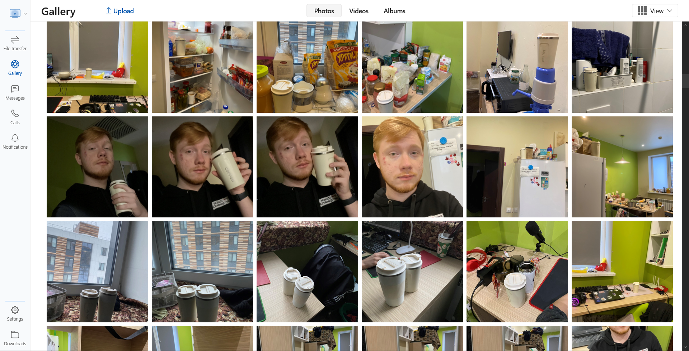
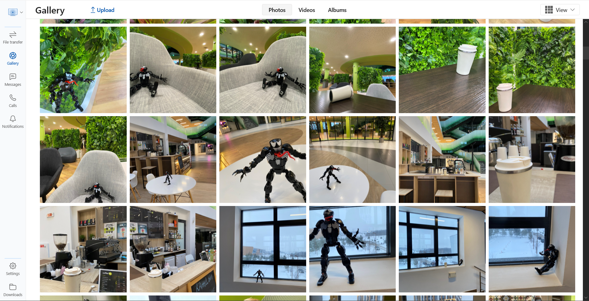
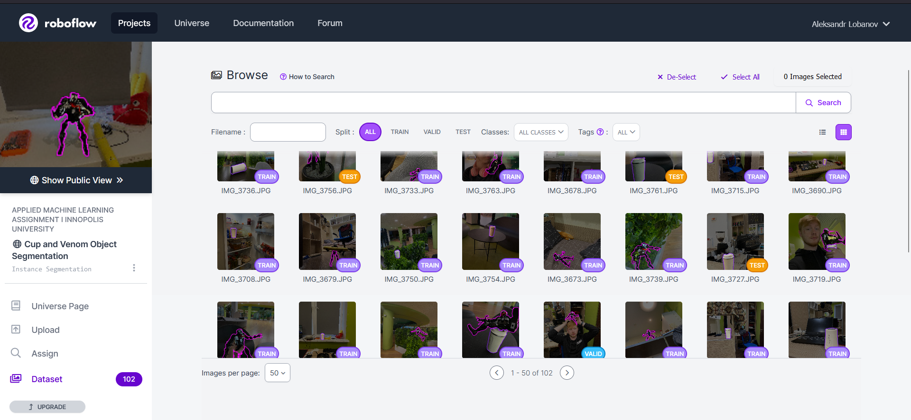
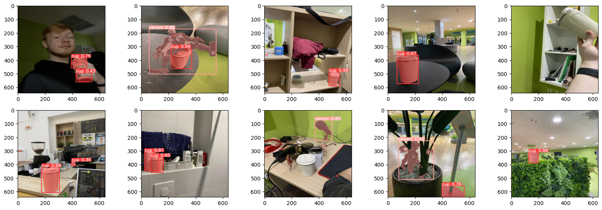
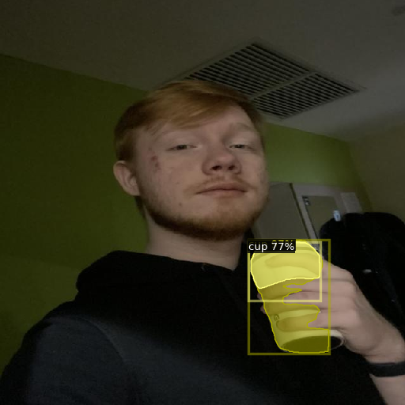
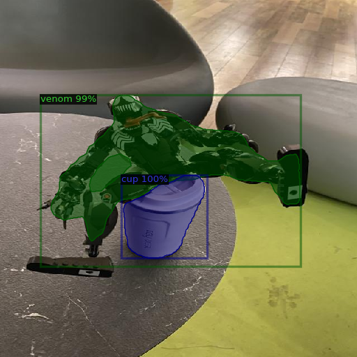

# Object Segmentation with YOLOv8 and Mask RCNN

This Github repository presents an evaluation of two state-of-the-art pre-trained instance segmentation models, Mask RCNN and YOLOv8, on a custom dataset of toy venom model and coffee cup. The models were not implemented from scratch, but rather were used as pre-trained models for detecting and segmenting new objects.

The repository includes evaluation metrics such as Mean Average Precision (mAP) for both models, along with their inference times. Mask RCNN achieved an mAP of 0.549 with an inference time of about 0.01s, while YOLOv8 achieved an mAP of 0.796 with an inference time of 5.5ms. The evaluation results reveal that YOLOv8 performed better in segmenting small objects located at the background, while Mask RCNN was more confident in segmenting objects with accurate masks.

Moreover, the repository provides an efficient way to evaluate pre-trained models on custom datasets for instance segmentation tasks. The code includes data pre-processing, model evaluation, and visualization scripts. It also allows users to fine-tune the pre-trained models on their own datasets with minimal modifications to the code.

## 1 + 2. Dataset Construction and Annotation

I took the same 102 images of a toy venom figure and a cup for coffee thah I have annotated for [object detection task](https://github.com/teexone/object-detection-aml) and reannotated them with polygons in Roboflow.

     
     

     

# 3 + 4. Training YOLOv8 and Faster RCNN

I made several little changes to the notebook that I used for [object detection model](https://github.com/teexone/object-detection-aml/blob/master/Object_Segmentation%20%5BYOLOv8%2C%20Faster%20R-CNN%5D.ipynb). Specifically, I switched model architectures to accomplish segmentation task instead of detection one and adjusted training configuration. 

     

<i>YOLO v8 output</i>

   

         
         
    

<i>Faster R-CNN output</i>

You can find full outputs in the notebook

## 5. Evaluation

Based on the updated results, I concluded that YOLOv8 is a less accurate instance segmentation model than Mask RCNN, with an mAP of 0.549 compared to 0.796 for both models. However, YOLOv8 has a faster inference time of 5.5ms per image compared to 0.01 seconds for Mask RCNN.

Furthermore, YOLOv8 is better at detecting objects in the background and can detect small objects more accurately than Mask RCNN. On the other hand, Mask RCNN is more confident in providing accurate segmentation masks for objects.

It is important to note that although Mask RCNN is more accurate in instance segmentation, it has a slower inference time compared to YOLOv8. However, the difference in inference time might not be as significant in practical applications with large datasets or real-time instance segmentation requirements.

Additionally, it is worth noting that the training time for YOLOv8 is significantly less than for Mask RCNN. This could be a crucial factor for applications where quick model training is required.

## Running the code

The code has been run in Google Colab environment. All additional libraries are installed using `pip`. You may find an original Google Colab notebook [here](https://colab.research.google.com/github/teexone/object-segmentation-aml/blob/main/Object_Segmentation_%5BYOLOv8%2C_Faster_R_CNN%5D.ipynb)

